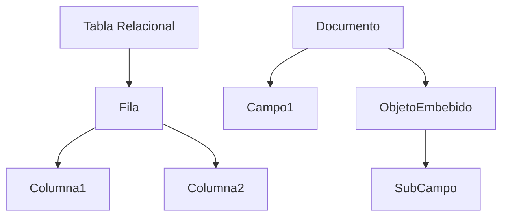
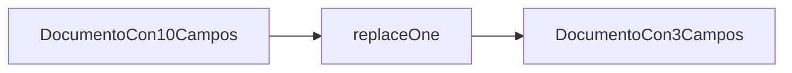
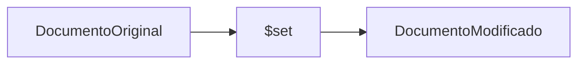
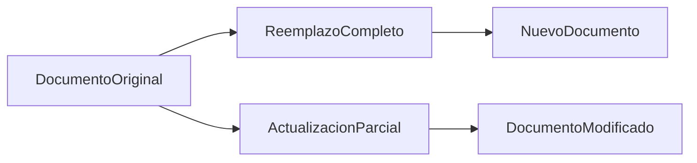

# Naturaleza de la actualización en modelo documental: Diferencia entre reemplazo y actualización parcial

En bases relacionales, las actualizaciones modifican celdas específicas en tablas normalizadas.

En MongoDB, el documento es la unidad atómica de almacenamiento.



En MongoDB existen dos formas de modificar documentos:

### Reemplazo completo (replaceOne):

replaceOne elimina completamente la estructura previa.



```js
db.cursos.replaceOne(
  { nombre: "Bases de Datos" },
  {
    nombre: "Bases de Datos",
    profesor: "Dr. Ramírez",
    creditos: 4
  }
)
```

* El documento anterior se elimina y se sustituye completamente.
* Si olvidamos campos, se pierden datos.

### Actualización parcial (updateOne):

updateOne mantiene la estructura no mencionada.



```js
db.cursos.updateOne(
  { nombre: "Bases de Datos" },
  { $set: { profesor: "Dr. Ramírez" } }
)
```

Solo se modifica el campo indicado.

### Diagrama conceptual



