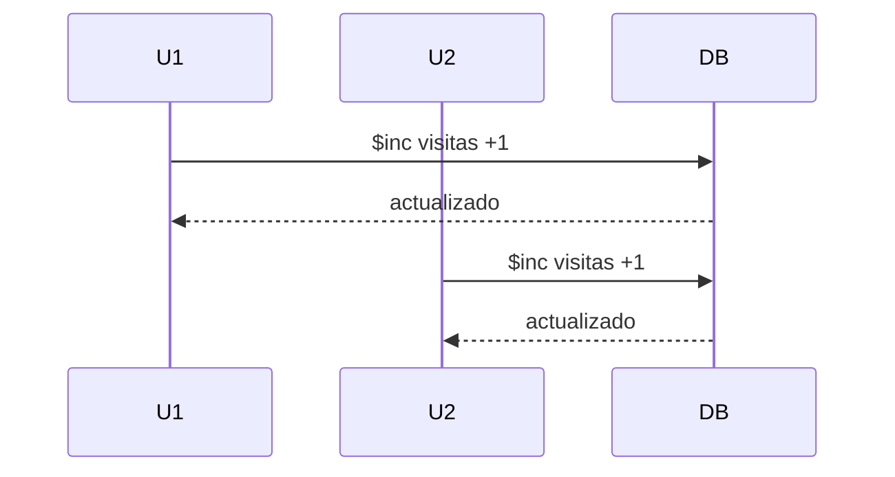

# Operadores principales

### $set

* Crea o modifica campos
* Puede actuar sobre rutas anidadas

```js
{ $set: { "cliente.telefono": "555-1234" } }
```

### $unset

Elimina un campo completamente.

```js
{ $unset: { telefono: "" } }
```

Uso típico: limpieza de datos obsoletos.

### $inc

* Incrementa valores numéricos.
* Evita condiciones de carrera en contadores.

```js
{ $inc: { visitas: 1 } }
```



MongoDB garantiza atomicidad a nivel documento.

### Modificación en documentos embebidos

```js
db.pedidos.updateOne(
  { "cliente.nombre": "Ana Pérez" },
  { $set: { "cliente.ciudad": "Barcelona" } }
)
```


