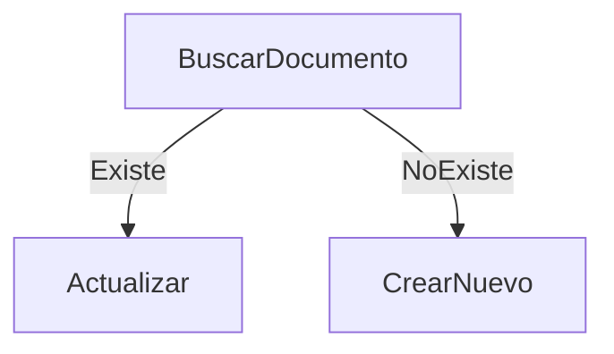

# Operadores avanzados

push  y  pull permiten manipular arrays dinámicamente.

Esto mantiene solo los últimos 5 elementos.

### $push

Agrega elementos a un array.

```js
{
$push: {
    comentarios: {
      $each: ["nuevo comentario"],
      $slice: -5
    }
  }
}
```

slice: Esto mantiene solo los últimos 5 elementos.

### $pull

Elimina elementos de un array.

```js
{ $pull: { estudiantes: "Carlos" } }
```

Ejemplo combinado:

```js
db.cursos.updateOne(
  { nombre: "Bases de Datos" },
  {
    $set: { activo: true },
    $inc: { creditos: 1 },
    $push: { estudiantes: "María" }
  }
)
```

### updateMany y riesgos

```js
db.cursos.updateMany(
  { creditos: { $lt: 3 } },
  { $set: { nivel: "Básico" } }
)
```

Riesgo: modificar más documentos de los esperados.

Buenas prácticas:

* Ejecutar primero:

```js
db.cursos.find({ creditos: { $lt: 3 } })
```

* Confirmar resultado
* Luego aplicar updateMany

### Upsert

Permite crear el documento si no existe.

Caso: registro de acceso diario.

```js
db.cursos.updateOne(
  { nombre: "Minería de Datos" },
  { $set: { creditos: 3 } },
  { upsert: true }
)
```



### Positional operator en arrays

El operador `$` permite actualizar el primer elemento coincidente.

Ejemplo:

```js
db.pedidos.updateOne(
  { "productos.nombre": "Mouse" },
  { $set: { "productos.$.precio": 20 } }
)
```

Limitación:

* Solo afecta el primer elemento que cumple la condición

Para múltiples coincidencias se requieren filtros más avanzados (arrayFilters).

### Modificación en arrays de objetos

```js
db.pedidos.updateOne(
  { "productos.nombre": "Laptop" },
  { $inc: { "productos.$.precio": -50 } }
)
```


