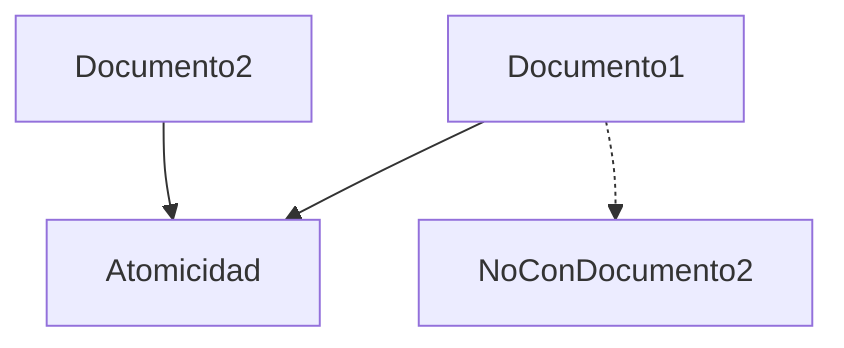

# Consideraciones de diseño

### Atomicidad y consistencia

MongoDB garantiza:

* Atomicidad por documento
* No por múltiples documentos (salvo por medio de transacciones)

Diagrama conceptual:

### Impacto de tamaño en el diseño

Actualizar arrays grandes puede:

* Reescribir documento completo
* Aumentar fragmentación
* Afectar rendimiento

Por ello es preferible:

* No incrustar relaciones ilimitadas
* Evaluar tamaño máximo esperado

### Errores comunes a evitar

* Usar replaceOne accidentalmente
* No probar filtros antes de updateMany
* No considerar crecimiento del documento
* No usar índices en campos de filtro

