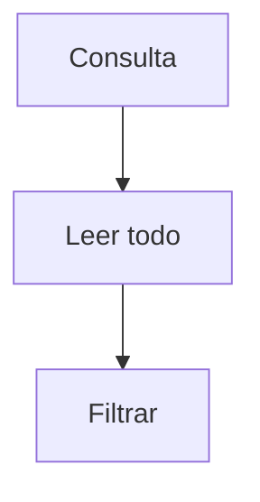
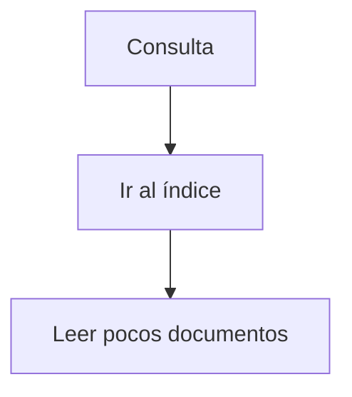
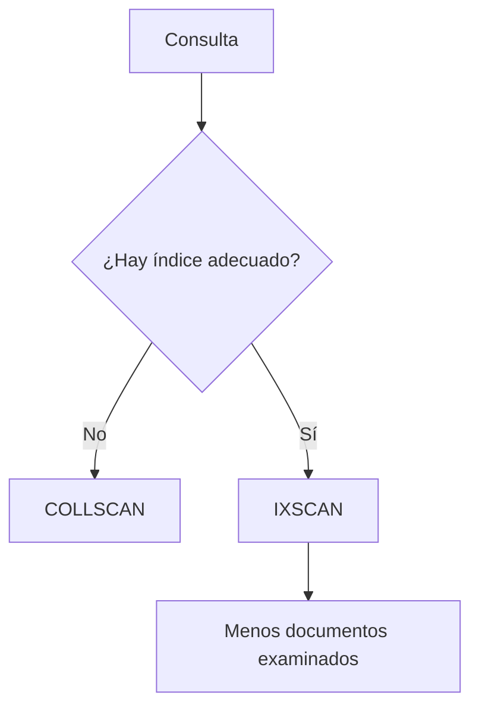

# Modelo mental final

Sin índice:

Con índice:

### Conclusión

Los índices no hacen la base “más rápida”.

Hacen las consultas específicas más eficientes.

Pero:

* Penalizan escritura
* Consumen memoria
* Requieren diseño estratégico

En sistemas reales, el diseño de índices es una disciplina propia dentro de la arquitectura de datos.

