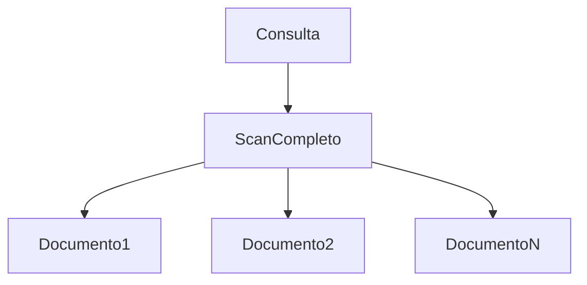
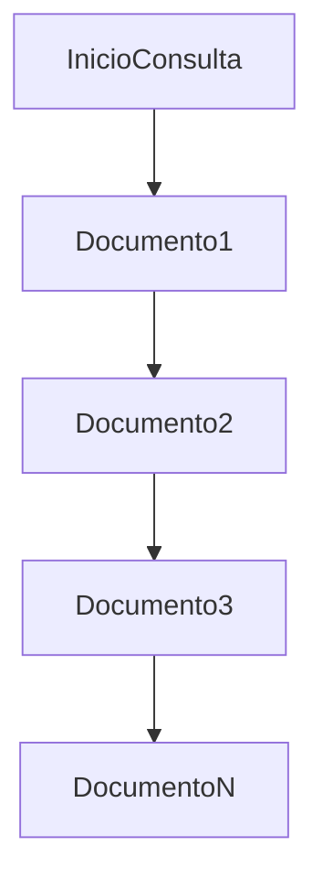

# El problema del collection scan (COLLSCAN)

Imaginemos que tenemos una colección `cursos` con 1 millón de documentos.

Si ejecutamos:

```js
db.cursos.find({ profesor: "Dra. Martínez" })
```

Y ​no existe índice sobre `profesor`​, MongoDB no tiene forma de “saltar” directamente a los documentos relevantes.

Entonces hace lo siguiente:

1. Lee el primer documento
2. Evalúa si cumple la condición
3. Lee el segundo documento
4. Evalúa
5. Repite hasta el final

Esto se llama:

COLLSCAN (Collection Scan)

Es equivalente conceptual a:

```SQL
SELECT * FROM cursos WHERE profesor = 'Dra. Martínez';
```

sin índice en SQL.

### ¿Por qué es grave?

* El costo crece linealmente con el tamaño de la colección
* Aumenta I/O en disco
* Aumenta consumo de CPU
* Genera latencias impredecibles

### Visualización conceptual



Tiempo ≈ O(n)

Cuando no existe índice, MongoDB realiza un recorrido completo:



En colecciones grandes, esto escala mal. funcionamiento d elos arboles b-tree, creacion de indices simples y compuestos

