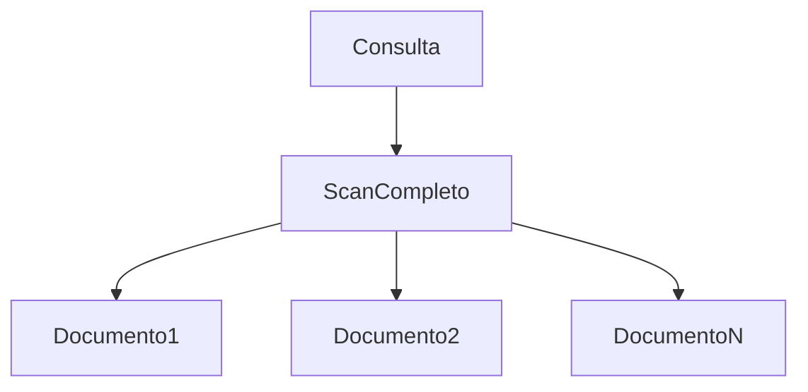
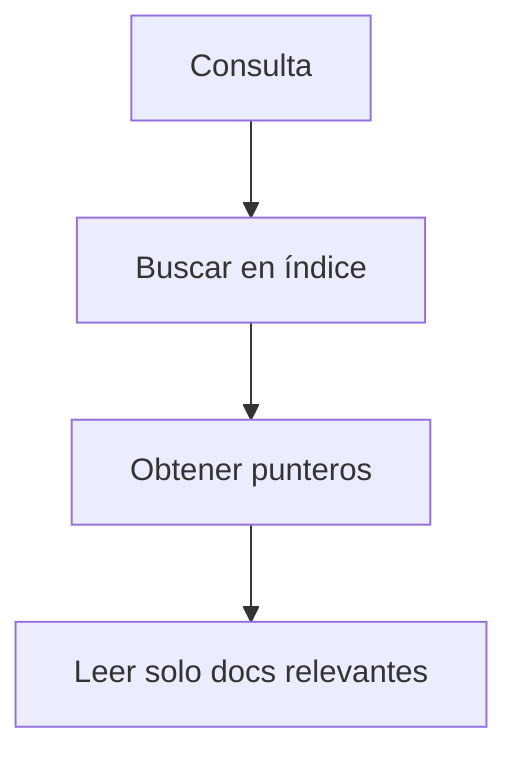
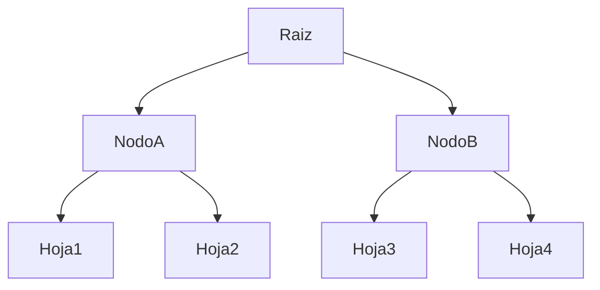

# ¿Qué es un índice?

Un índice es una estructura auxiliar que permite localizar documentos sin recorrer toda la colección.

Sin índice:



Con índice:



### Uso

Un índice es una estructura adicional (tipo B-Tree) que almacena:

valor\_del\_campo → referencia\_al\_documento

Ejemplo conceptual:

```code
Índice profesor
--------------------------------
"Dr. Pérez"      -> doc1
"Dra. Martínez"  -> doc2
"Dra. Martínez"  -> doc15
```

Ahora la consulta:

```JS
db.cursos.find({ profesor: "Dra. Martínez" })
```

No recorre toda la colección.

Hace:

1. Busca en el índice
2. Encuentra punteros
3. Recupera solo esos documentos

Eso es:

IXSCAN (Index Scan)

### Estructura conceptual de un índice

MongoDB utiliza estructuras tipo B-Tree.



